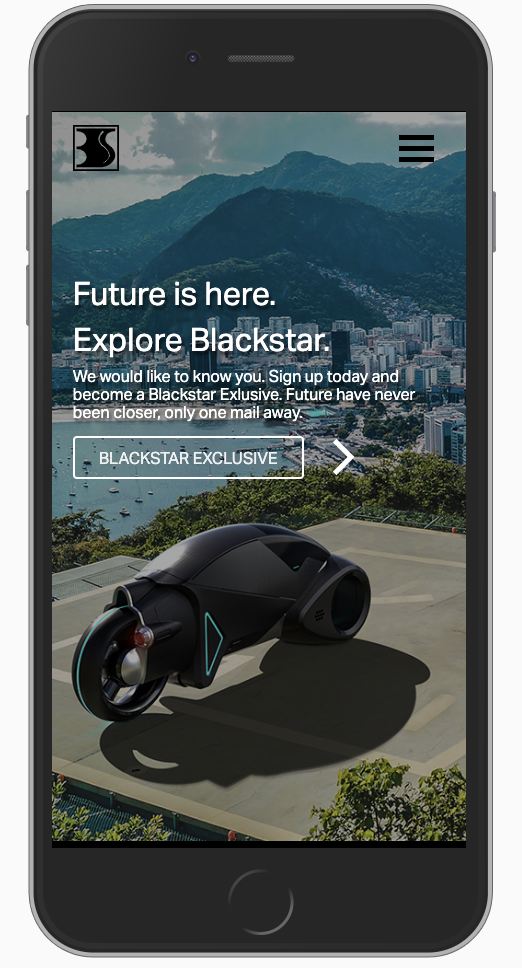

# Blackstar

### You are special. BlackStar.

### Introduction
Blackstar is the first cross-project for WU19. We worked together with Digital Designers(DD19) and Computer Graphic Designers(CGD19).

List of participants:
* Ida Pääjärvi Linell (DD) 
* Johanna Schulz (DD)
* Oskar Turesson (WU)
* André Chamoun (WU)
* Olof Ljunggren (CG)
* Alexander Lyreö (CG)

## Build Process

This landing page was made with HTML, CSS and JavaScript. We built it mobile first then scaled everything up and made it responsive.

## Where to look at the site
The site is uploaded to Netlify. [Link to the site](https://blackstar6.netlify.com/)

## License

This project is licensed under the MIT License - see the LICENSE file for details

YRGO 2019